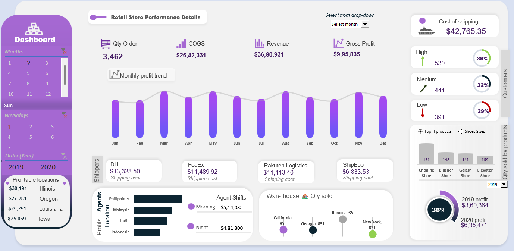

# Order & Shipping Analysis - Excel Dashboard

## Objective
As a Data Analyst specializing in logistics and supply chain management, I led multifaceted initiatives focused on enhancing operational efficiency and supply chain performance. Developed and implemented an Order and Shipping Dashboard to streamline order processing, optimize shipping logistics, and enhance customer satisfaction within the organization. I conducted thorough analyses to uncover insights driving strategic decisions and process improvements. Utilizing advanced analytics techniques and visualization tools, I provided actionable recommendations to streamline inventory management, optimize procurement processes, mitigate supply chain risks, and enhance overall operational resilience.

## Analysis Objectives
1.Customer Insights:
Analyze customer satisfaction data to identify factors influencing customer experience, such as order accuracy, delivery timeliness, and product quality. Segment customers based on their purchasing behavior, geographic location, and order frequency to tailor marketing strategies and promotions.

2. Product Analysis:
Analyze sales data to identify top-performing products, seasonal trends, and product preferences across different demographics and regions. Determine the profitability of products by comparing unit prices with costs and analyzing sales volumes.

3. Location Optimization:
Analyze customer satisfaction data to identify factors influencing customer experience, such as order accuracy, delivery timeliness, and product quality. Segment customers based on their purchasing behavior, geographic location, and order frequency to tailor marketing strategies and promotions.

4. Performance Evaluation:
Assess the performance of agents based on order processing time, customer satisfaction ratings, and adherence to shipping schedules. Evaluate the efficiency of warehouses in terms of order fulfillment and inventory management.

5. Trend Identification:
Identify emerging trends and patterns in order and shipping data, such as peak ordering periods, popular product categories, and fluctuations in demand. Monitor changes in customer preferences and market dynamics to anticipate future demand and adjust inventory levels accordingly.

6. Cost Analysis:
Conduct cost-benefit analysis to evaluate the impact of shipping methods, warehouse locations, and inventory management strategies on overall operational costs. Identify opportunities for cost savings and efficiency improvements without compromising service quality.

7. Forecasting and Planning:
Develop predictive models to forecast future order volumes, sales revenues, and inventory requirements based on historical data and market trends. Generate actionable insights to support strategic decision-making and resource allocation, such as staffing levels, inventory investments, and marketing campaigns.

8. Risk Management:
Identify potential risks and vulnerabilities in the order and shipping process, such as supply chain disruptions, inventory shortages, and quality control issues. Develop contingency plans and mitigation strategies to minimize the impact of unforeseen events on customer satisfaction and operational performance.

## Dashboard Snapshot

• Revenue: The store generated $26,42,331 in revenue.

• Cost of Goods Sold (COGS): The cost of goods sold was $36,80,931. This suggests a cost of goods sold percentage (COGS/Revenue) of around 139%, which is high and indicates a need to investigate potential cost reduction strategies.

• Gross Profit: The store's gross profit is $9,95,835, highlighting a need for cost management to improve profitability.

• Quantity of Orders: The store received 3,462 orders in the displayed timeframe.

• Top Selling Products: Shoes, Chopines, Galesh Elevators, and Blucher Shoes are the topperforming products, offering insights into customer preferences and potential upselling/crossselling opportunities.

• Shipping Costs: The dashboard provides a breakdown of shipping costs by carrier (e.g., DHL, FedEx). This information can be used to negotiate better rates or optimize carrier selection based on cost and delivery speed.

• Profitable Locations: The dashboard identifies Illinois and Georgia as the most profitable states, suggesting potential regional differences in customer base or marketing effectiveness. Further analysis is needed to understand these variations.

• Day-wise Performance: Sundays appear to be the least profitable day. Analyzing customer behavior and marketing efforts on Sundays might reveal areas for improvement.

• Product Category Performance: Shoes are the top-selling category, which can guide future buying decisions and store layout optimization.

• This dashboard provides a good overview of the retail store's performance, highlighting areas like profitability and top-selling products. However, a more comprehensive analysis requires additional data points and deeper exploration of trends and variations.

